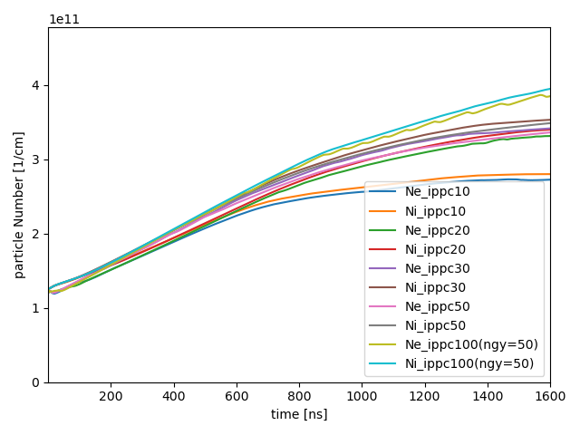

# list
- long: initPPC=10
- large: initPPC=20
- large2: initPPC=30
- large3: initPPC=50
- large4: initPPC=100, ngy=50
# note
- 十分に高速化できたので、Benchmark 計算の再現にトライ。
- initPPC=10 から試してみたところ、下流領域に強い電場が生じておかしな準定常解に行き着いた。
- long_Ex:
https://github.com/user-attachments/assets/bb2a3e97-5d8f-4d01-8e9f-0b9639ad924e
- long_Ey:
https://github.com/user-attachments/assets/e16b859e-e4d4-4f9a-9a84-13a9ad3b317a
- 波状構造が崩れてるような印象を受けたので、粒子数が少ないことにより存在しない波が励起されている可能性が考えられる。
- ということで初期粒子数を増やして試してみた。
- large_Ex,Ey:
https://github.com/user-attachments/assets/6732fc4a-ab3e-470f-9f44-7b1e9455fa1e
https://github.com/user-attachments/assets/16d965b6-06b6-40cc-8269-6835674516be
- large2_Ex,Ey:
https://github.com/user-attachments/assets/ae928a3e-b021-4d6a-998a-638aea08932d
https://github.com/user-attachments/assets/bc551684-7539-470f-9fcc-d828d86a7ca5
- large3_Ex,Ey:
https://github.com/user-attachments/assets/82b04d86-c1a8-4218-a38a-66e6a6bc1966
https://github.com/user-attachments/assets/71660e83-c03c-4f76-bd0b-b7e0db8f1ab7
- large4_Ex,Ey:
https://github.com/user-attachments/assets/a106cf0a-e261-480e-a3ee-5f5d34df4c17
https://github.com/user-attachments/assets/3a76ebd1-ea03-436d-8b96-71dff0262309
- initPPC=10 よりマシにはなっているが、上流側で変な電場がチラつく。
- 粒子数の時系列を見てみると 1.5[us] 程度で 3.5e11[1/cm] あたりで粒子数がサチった。

- lab の PIC_MCC コードでは ippc=20 で 0~2.5[us] にかけて 7e11[1/cm] くらいまで粒子数が伸び続けていたので、なにか違った現象が出ている様子。

