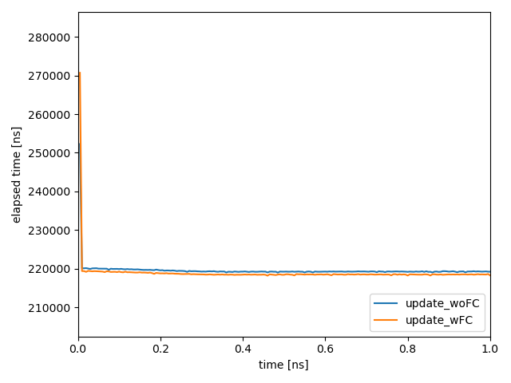

# list
- large4_light_woFC: initPPC=100, ngy=200, function constant 使用前
- large4_light_wFC: initPPC=100, ngy=200, function constant 使用前
# note
- 形状関数の変更に対応するために、引数付きでカーネルをコンパイルするメソッドを使用する方針に変更。
- 定数引数付きでコンパイルすると粒子の境界処理における条件分岐のコストが減らせるので、まずはそこを検証する。
- 下図は update の境界条件処理を function constant で分岐させたコードと比較したもので、わずかに改善してる。
 
- 検証のついでなので、悪くならなければ ok。
- 将来的に粒子衝突を追加することを見越して update と integCDens はわけて定義していたが、定数引数でコンパイルできるなら統合しても良さそう。試してみる。