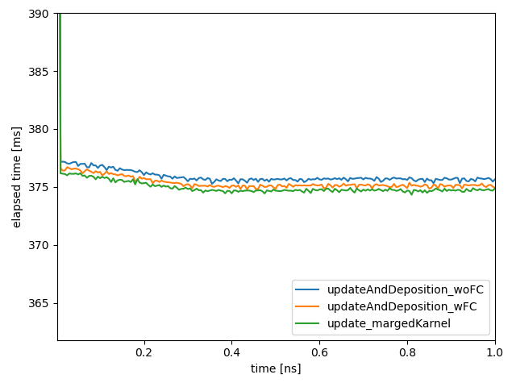
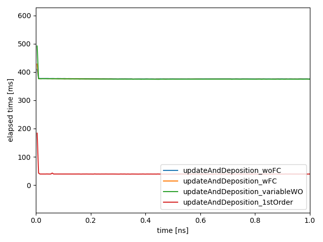

# list
- large4_light_woFC: initPPC=100, ngy=200, function constant 使用前
- large4_light_wFC: initPPC=100, ngy=200, function constant 使用前
# note
- 形状関数の変更に対応するために、引数付きでカーネルをコンパイルするメソッドを使用する方針に変更。
- 定数引数付きでコンパイルすると粒子の境界処理における条件分岐のコストが減らせるので、まずはそこを検証する。
- 下図は update の境界条件処理を function constant で分岐させたコードと比較したもので、わずかに改善してる。
 
- 検証のついでなので、悪くならなければ ok。
- 将来的に粒子衝突を追加することを見越して update と integCDens はわけて定義していたが、定数引数でコンパイルできるなら統合しても良さそう。試してみる。
- integCDens を統合したバージョンと比較。
 
- あんまりかわらんので、タスクごとの所要時間が追跡できて便利なので元の別れたままに戻しておく。
- 念のため、marged バージョンは margedKarnel ブランチに残しておく。
- Weighting を変更できるようにした。5th-order の時点で性能が劣化しないかをチェック。問題なさそう。
 
- 1st order に変更。当然 1st Order の方が早い。
 