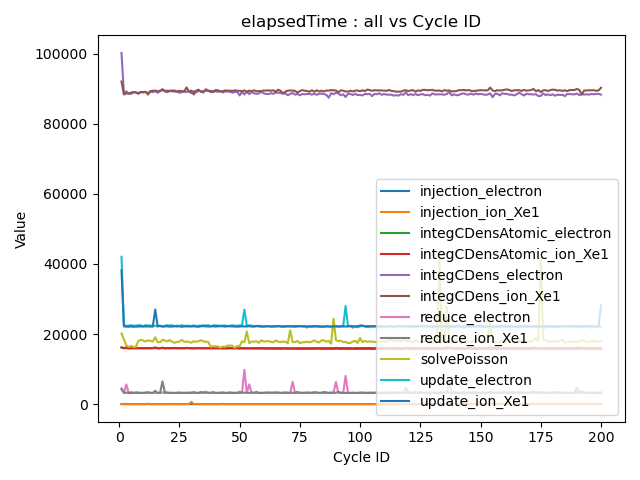
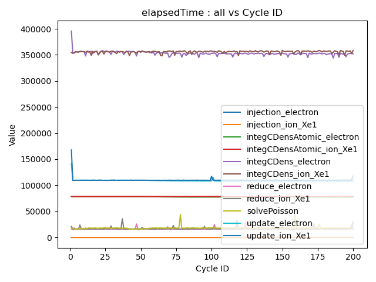
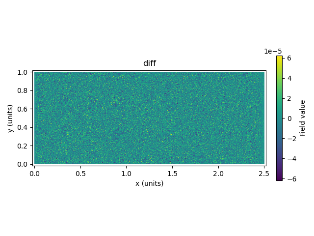

- integratechargedensity の処理速度をなんとかして早くしたい。
- 実は最近は metal でも float の atomic が使えるようになった（M2から？）らしいので試してみたところ、とても早くなった。
 
- initParticleNumPerCell を 100 にした計算でも問題なく実行できて、従来のバージョンよりもはるかに早い。
 
- 差分もチェックしたが特に問題なく、本採用で良さそう。（なんなら元の integCDens が id=pNum の粒子まで使用しておりバグってた）
 