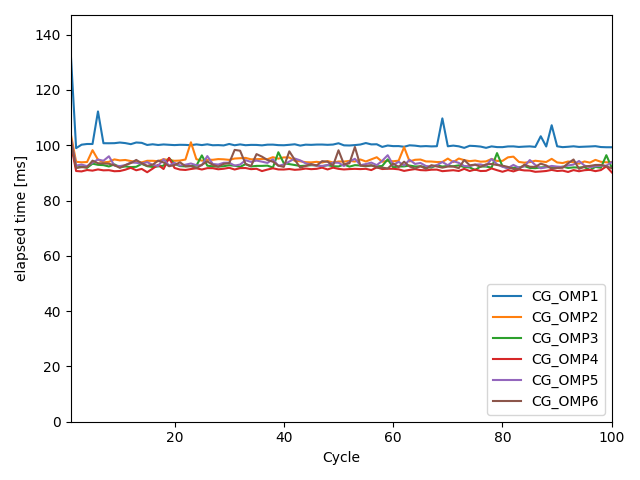
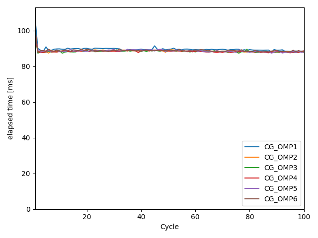
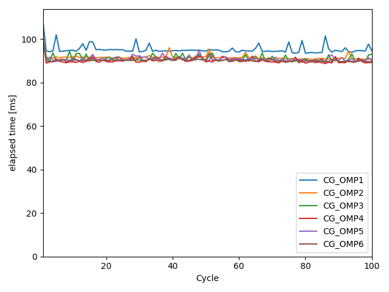
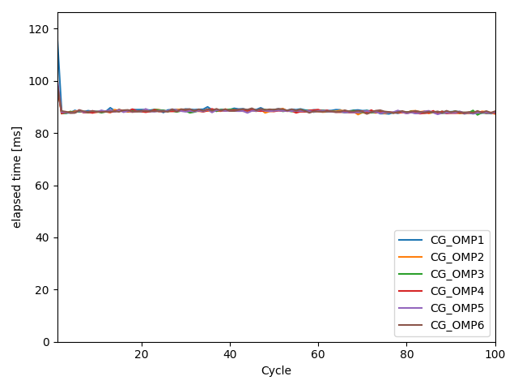

## CG vs BiCGStab
- 対称行列を解くなら CG が使える。
- EMField:outputCSRmtx で csr 行列を出力し、checkSymmetry.py で対称性をチェックする。問題なさそう。
- 節点定義の Neumann 境界が非対称な離散化になっているので、いったん Neumann 境界は非対応ということにして CG ソルバを試した。
- 反復回数は少し増えるが、計算時間は 10%ほど落とせそう。
 
 

## OpenMP
- 実行時に `export OMP_NUM_THREADS=$i` とすると、OpenMP の i スレッド並列で実行可能。
- CG でも BiCGStab でも処理速度はスレッド数 4くらいで頭打ちになり、処理速度は 3倍くらいになった。
 
 

## preconditioner
- smoothed_aggregation のオプションとして固有値の取りうる範囲を推定する機能があるので、その ON/OFF を試した。
- おそらく反復回数が小さくなる場合もあるのだろうが、見たところあんま変わらん。
 
- aggregation の閾値をパラスタ。値が小さいほど粗分割の層数が増える。
- Vサイクルについて閾値を振ってみたが、依存性はあまり見えてこない。
- eps = 0.16 が若干収束が早いかも？
 
- この傾向は Wサイクルでも同じだが、デフォルトのVサイクルの方が処理が早そう。
 
- threshold = 0.32 では収束せず、反復回数が maxiter を超えた。おそらく前処理が機能してない状態。
 
 
- 固有値推定のオンオフも試してみたが、あまり関係性は見えてこない。
 
 
- aggregation_emin も試してみたが、シンプルに収束が遅いみたい。やらなくて良さそう。
 
 
 

## optimization option at compile
- そういえばコンパイル時の最適化オプションを入れてなかった。
- 指定なしと比較したところ、poisson がとても早くなった。
- ICDE も多少軽くなってるので、単一 CPU でのループがあるところの負荷バランスが変わってる。
- ICDE は GPU 内で reduction しているが、CPU 側でやるのも検討の余地がありそう。
 

## OpenMP for integrate charge density
- OpenMP で電荷密度積分の partialSum を足しあわせる部分を並列化してみた。
- 色々やり方はあるが、OpenMP を使わないコードを上回るパターンは見つからなかった。
- jループの中だけ並列化
 
- atomic 演算
 
- ローカルバッファ
 
- 和の順序変更
 
- reduction 演算
 